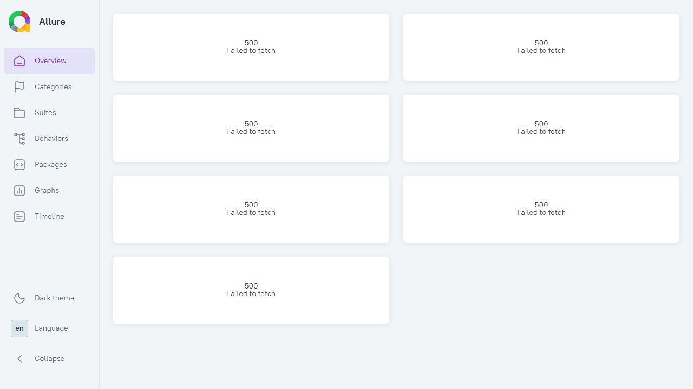
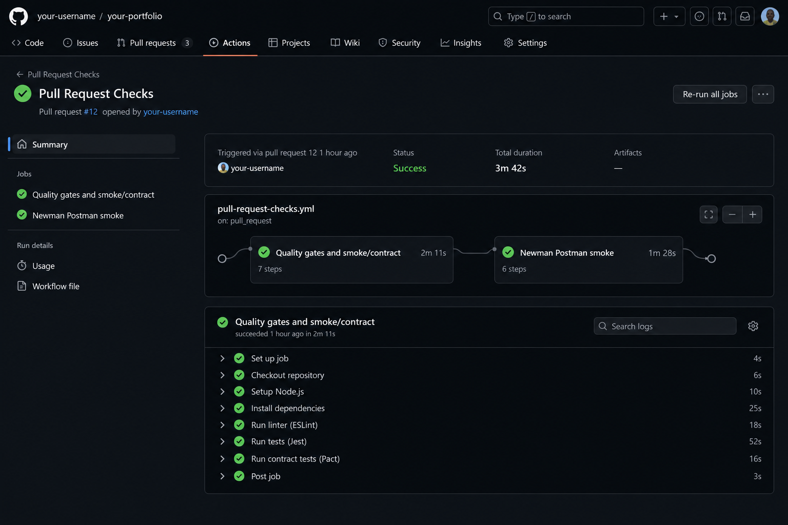
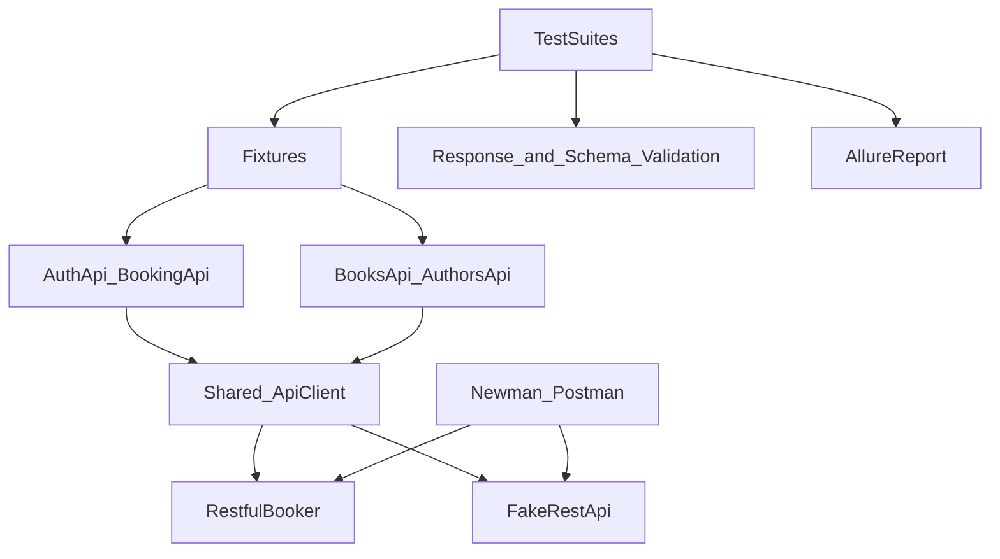
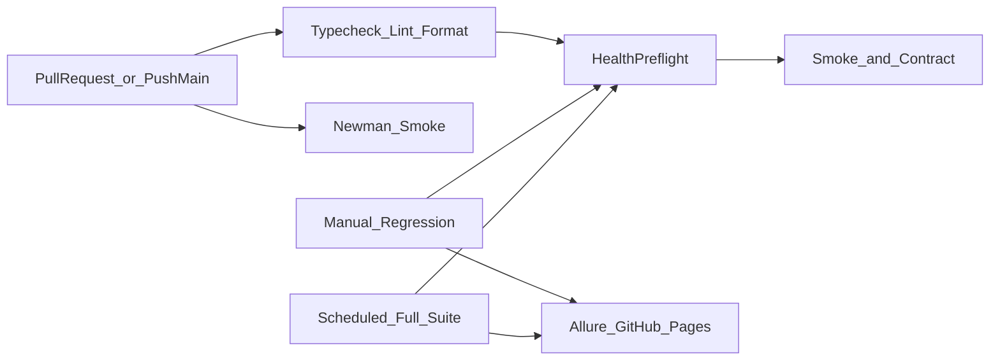

# REST API Test Automation Framework

Production-like REST API automation framework built with TypeScript, Playwright, Postman/Newman, Docker, GitHub Actions and Allure.

[](https://github.com/codedevdev/api-test-automation-framework/actions/workflows/pull-request.yml)
[](https://codedevdev.github.io/api-test-automation-framework/)
[](https://nodejs.org/)
[](https://www.typescriptlang.org/)
[](https://playwright.dev/)
[](https://learning.postman.com/docs/collections/using-newman-cli/command-line-integration-with-newman/)
[](./LICENSE)

## Quick start

```bash
git clone https://github.com/codedevdev/api-test-automation-framework.git
cd api-test-automation-framework
npm ci && cp .env.example .env && npm run healthcheck
npm run test:smoke
```

Live reports: [Allure on GitHub Pages](https://codedevdev.github.io/api-test-automation-framework/) · [CI workflow](https://github.com/codedevdev/api-test-automation-framework/actions/workflows/pull-request.yml)

## Demo

| Allure report (smoke run) | CI pipeline (PR checks) |
| --- | --- |
|  |  |

## Project overview

This repository demonstrates a maintainable API automation framework for QA engineers. It targets two public APIs with a shared client core and service-specific layers:

| API | Docs | Focus |
| --- | ---- | ----- |
| Restful Booker | [API docs](https://restful-booker.herokuapp.com/apidoc/index.html) | Auth + booking CRUD |
| Fake REST API | [Swagger UI](https://fakerestapi.azurewebsites.net/index.html) | Books + Authors simulator |

## Key features

- Layered API client (no raw HTTP scattered across tests)
- Dual Playwright projects with independent base URLs
- JSON Schema validation via AJV
- Faker-based factories with overrides
- Secret-safe request logging
- Smoke / regression / negative / contract / e2e suites
- Complementary Postman collections run with Newman (CLI smoke)
- GitHub Actions quality gates and scheduled runs
- Allure + Playwright HTML + Newman HTML Extra reporting
- Dockerized test runner for reproducible execution

## Technology stack

- TypeScript (strict)
- Playwright `APIRequestContext`
- Postman Collection v2.1 + Newman
- Node.js 20+
- AJV
- Allure Report
- GitHub Actions
- Docker / Docker Compose
- ESLint + Prettier
- dotenv
- Faker

## Architecture overview



## Project structure

```text
src/
  apis/                 # Per-service API classes
  clients/              # Shared ApiClient
  config/               # Environment and test config
  factories/            # Test data factories
  fixtures/             # Playwright fixtures
  schemas/              # JSON schemas
  types/                # TypeScript contracts
  utils/                # Logger, validators, cleanup
tests/
  restful-booker/       # Booker suites
  fake-rest-api/        # Fake API suites
postman/                # Postman collections + Newman reports
docs/                   # Strategy, coverage, risks, bugs
.github/workflows/      # CI pipelines
```

## Test coverage

Approximate automated coverage:

| Suite | Restful Booker | Fake REST API | Total |
| ----- | -------------: | ------------: | ----: |
| Smoke | 5 | 4 | 9 |
| Contract | 4 | 5 | 9 |
| Regression | 13 | 8 | 21 |
| Negative | 14 | 8 | 22 |
| E2E | 2 | 2 | 4 |
| **Playwright all** | **38** | **27** | **65** |
| Newman smoke | 5 | 2 | 7 |

See [docs/api-coverage.md](./docs/api-coverage.md) and [docs/test-cases.md](./docs/test-cases.md).

## Prerequisites

- Node.js 20+
- npm 10+
- Docker (optional, for the test runner image)
- Network access to both public APIs

## Local setup

```bash
npm ci
cp .env.example .env
npm run healthcheck
```

## Environment variables

```env
BOOKER_BASE_URL=https://restful-booker.herokuapp.com
BOOKER_USERNAME=admin
BOOKER_PASSWORD=password123
FAKE_API_BASE_URL=https://fakerestapi.azurewebsites.net
API_TIMEOUT=15000
LOG_LEVEL=info
```

## Running tests

```bash
npm run test:smoke
npm run test:contract
npm run test:regression
npm run test:negative
npm run test:e2e
npm run test:all
```

## Running tests by suite or tag

```bash
npm run test:booker
npm run test:fake-api
npx playwright test --grep @smoke
npx playwright test --grep @e2e --project=restful-booker
```

## Newman / Postman smoke

Complementary CLI smoke layer (does not replace Playwright):

```bash
npm run newman:booker
npm run newman:fake-api
npm run newman:smoke
```

Collections and environments live under `postman/`. HTML Extra reports are written to `postman/newman/` (gitignored).

## Docker commands

```bash
npm run docker:build
npm run docker:test
npm run docker:down
```

The Compose stack runs the **test runner** against the remote APIs. It does not host Restful Booker locally.

## CI/CD overview



| Workflow | Trigger | Purpose |
| -------- | ------- | ------- |
| `pull-request.yml` | PR + push to `main` | Quality gates + Playwright smoke/contract + Newman smoke (parallel job) |
| `regression.yml` | Manual (`workflow_dispatch`) | Full suite with optional URL overrides |
| `scheduled-tests.yml` | Cron `0 2 * * 1,4` UTC | Full suite Mon/Thu 02:00 UTC |
| `allure-pages.yml` | After scheduled/regression | Publish Allure to GitHub Pages |

## Allure Report

**Live report:** https://codedevdev.github.io/api-test-automation-framework/

Local generation:
```bash
npm run test:smoke
npm run allure:generate
npm run allure:open
```

Install Allure CLI globally if needed: `npm install -g allure-commandline`.

Reports include suites, tags, steps, and sanitized failure context. Tokens and passwords are redacted by the logger/sanitizer.

## Example test scenario

```typescript
const booking = bookingFactory.create({
  firstname: 'Pavlo',
  totalprice: 500,
});

const created = await bookingApi.createBooking(booking);
expect(created.status).toBe(200);

const bookingId = created.body.bookingid;
const fetched = await bookingApi.getBooking(bookingId);
expect(fetched.body.firstname).toBe('Pavlo');
```

## Test documentation

- [Architecture and design decisions](./docs/architecture.md)
- [Test strategy](./docs/test-strategy.md)
- [Test cases](./docs/test-cases.md)
- [API coverage](./docs/api-coverage.md)
- [Risk analysis](./docs/risk-analysis.md)
- [Bug reports / limitations](./docs/bug-reports.md)

## Known limitations

- Both targets are public demos and may be slow or temporarily unavailable.
- Restful Booker uses shared data and resets periodically.
- Restful Booker has intentional quirks (for example DELETE `201`, bad auth `200`).
- Fake REST API write calls simulate responses and do not reliably persist state.
- Details: [docs/bug-reports.md](./docs/bug-reports.md)

## Roadmap

- Add OpenAPI-driven schema sync for Fake REST API
- Optional contract drift checks in CI
- Richer Allure categories and history trend on Pages
- Lightweight performance smoke budget per endpoint

## Author

**Pavlo** - QA Automation Engineer

- GitHub: `https://github.com/codedevdev`

## License

MIT - see [LICENSE](./LICENSE).
